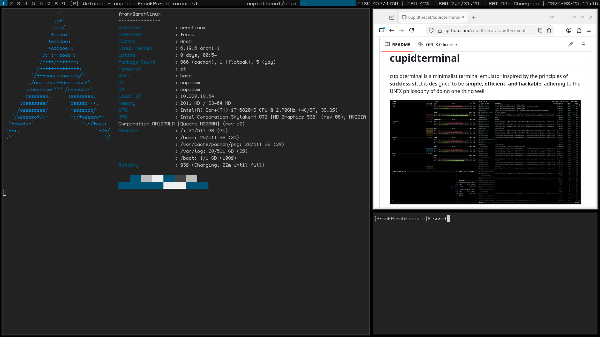

# cupidterminal

cupidterminal is a minimalist terminal emulator inspired by the principles of **suckless st**. It is designed to be **simple, efficient, and hackable**, adhering to the UNIX philosophy of doing one thing well.



## Features

- **Lightweight**: Minimal dependencies, only requiring `Xlib` and `Xft`.
- **Simple Configuration**: Easily customize fonts, colors, and terminal size by modifying `config.h`.
- **Efficient Rendering**: Utilizes `Xlib` for rendering text and handling input.
- **Keyboard Driven**: Optimized for keyboard navigation with minimal mouse support.
- **PTY Integration**: Spawns a shell using a pseudo-terminal (PTY) for seamless command execution.
- **Basic ANSI Escape Sequence Handling**: Strips out basic ANSI escape sequences for clean text rendering.
- **Line Buffering**: Maintains a buffer of up to 100 lines with 1024 characters each for terminal output.

## Dependencies

Ensure you have the following installed:

### For Arch Linux

```bash
sudo pacman -S xorg-server libx11 libxft
```

### For Debian/Ubuntu

```bash
sudo apt-get install libx11-dev libxft-dev
```

## Installation

Clone the repository and compile the source code:

```bash
git clone https://github.com/cupidthecat/cupidterminal.git
cd cupidterminal
make
```

## Usage

Run CupidTerminal:

```bash
./cupidterminal
```

- **Quit**: Press `q` to exit the terminal emulator.

## Configuration

Customize CupidTerminal by modifying the `config.h` file. Key configuration options include:

```c
#define FONT "monospace"       // Font family
#define FONT_SIZE 12            // Font size in points
#define TERMINAL_WIDTH 80       // Number of character columns
#define TERMINAL_HEIGHT 24      // Number of character rows
#define MAX_LINES 100           // Maximum number of lines in the buffer
#define MAX_CHARS 1024          // Maximum number of characters per line
```

### Steps to Configure:

1. Open `config.h` in your preferred text editor.
2. Adjust the configuration parameters as desired.
3. Recompile the project to apply changes:

    ```bash
    make clean && make
    ```

## Keybindings

- **Quit**: Press `q` to close the terminal emulator.
- **Backspace**: Handles backspace key to delete characters.
- **Input Handling**: All other keypresses are sent directly to the spawned shell.

## Future Enhancements

- **Scrollback Buffer Support**: Implement scrolling through past terminal output.
- **Enhanced ANSI Escape Sequence Handling**: Improve support for a wider range of ANSI codes for better text formatting.
- **Dynamic Resizing**: Allow the terminal window to be resized dynamically, adjusting the number of visible rows and columns accordingly.
- **Clipboard Support**: Enable copying and pasting text between the terminal and other applications.
- **Mouse Support**: Add basic mouse interaction capabilities.
- **Theming**: Introduce customizable color schemes and themes.

## License

CupidTerminal is released under the **MIT License**. Feel free to modify and distribute it as per the license terms.

## Contributing

Contributions are welcome! If you have ideas for improvements or bug fixes, please submit a pull request or open an issue. When contributing:

- Keep changes minimal and focused.
- Follow the existing coding style for consistency.
- Provide clear descriptions and documentation for your contributions.

## Project Structure

- **main.c**: Handles initialization, event loop, PTY management, and integrates drawing and input handling.
- **draw.c / draw.h**: Manages rendering text to the X11 window and maintaining the terminal buffer.
- **input.h**: Declares input handling functions.
- **config.h**: Contains configuration settings for fonts, terminal size, and other parameters.
- **Makefile**: Build instructions for compiling the project.

## Acknowledgements

Inspired by the **suckless st** terminal emulator, aiming to maintain simplicity and efficiency while providing a solid foundation for further customization and enhancement.
