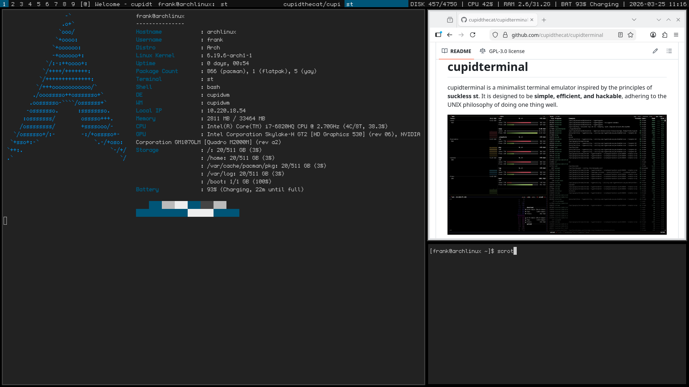

# cupidterminal

cupidterminal is a minimalist X11 terminal emulator. It is architecturally inspired by suckless **st** but is its own codebase with its own filenames and roadmap. The project is built around a strict separation between terminal logic and the X11 layer so the parser can be reasoned about, tested, and ported without ever touching Xlib.



## Features

### Architecture

- **Hard module boundary.** Terminal logic lives in `cupid.c` and contains zero Xlib symbols. The X11 layer lives in `xwin.c` and talks to the parser only through the callback contract in `xwin.h`. A `make check-no-x11` build gate enforces the boundary by greeping for Xlib namespace patterns.
- **st-compatible cell layout.** `Glyph` is exactly 16 bytes (`Rune u`, `uint16_t mode`, `uint32_t fg`, `uint32_t bg`), the same shape upstream st uses. CSI / SGR patches transfer with minimal massaging.
- **Side-channel for combining marks.** Base codepoint lives in `Glyph.u`. Combining marks are stored sparsely on the row (`TermLine.combs`) and re-encoded at render time. This survives scroll, insert-line, and delete-line correctly because the whole `TermLine` (combs + line pointer + dirty bit) moves with the row, not just the `Glyph` array.

### VT / ANSI

- **Cursor movement.** CUU / CUD / CUF / CUB, CUP / HVP, CHA / VPA, CNL / CPL, save / restore (DECSC / DECRC), tab forward / back (HT / CBT).
- **Erasing.** CSI K (EL: erase in line, modes 0/1/2), CSI J (ED: erase in display, modes 0/1/2/3 including scrollback clear).
- **Scrolling region.** DECSTBM. Scroll up / down (SU / SD).
- **Insert / delete.** ICH (insert chars), DCH (delete chars), IL (insert lines), DL (delete lines), ECH (erase chars).
- **Pending-wrap semantics.** Right-margin behavior matches st: writing in the rightmost column enters a "pending wrap" state where the next action decides whether wrap occurs.
- **Auto-wrap toggle.** DECAWM (`?7`).
- **Origin mode.** DECOM (`?6`) restricts cursor positioning to the scrolling region.
- **Insert mode.** IRM (mode 4) shifts existing cells right on each character.
- **Repeat.** REP (CSI b) re-emits the last printable.
- **Reverse video.** DECSCNM (`?5`) flips foreground and background screen-wide.
- **Cursor visibility / shape.** DECTCEM (`?25`) toggles, DECSCUSR sets shape (block, underline, bar, snowman) and steady / blinking variant.
- **Application cursor keys.** DECCKM (`?1`) switches arrow keys to SS3 sequences.
- **Charset.** G0 / G1 selection, SO / SI shifts. DEC Special Graphics (VT100 ACS box-drawing).
- **Device attributes / status reports.** DA (CSI c), DSR cursor position (CSI 6n), DECID.
- **Soft / hard reset.** DECSTR (CSI ! p), RIS (ESC c).
- **Status line.** BEL (`\a`) routes to `xbell()` for one ring per character.

### Color

- **Truecolor SGR.** `\033[38;2;r;g;bm` and `\033[48;2;r;g;bm` for direct 24-bit RGB on foreground and background, packed via the `TRUECOLOR(r,g,b)` macro and detected by `IS_TRUECOL(x)`.
- **256-color palette.** `\033[38;5;Nm` and `\033[48;5;Nm` for the standard xterm 256 palette.
- **OSC 4 palette overrides.** `\033]4;index;color\007` redefines individual palette entries at runtime.
- **OSC 10 / 11 / 12 dynamic defaults.** Set the default foreground, background, and cursor colors from the running shell or app.
- **OSC 104 reset.** `\033]104\007` resets palette entries (single index or all).
- **SGR attributes.** Bold, faint, italic, underline, blink, reverse, struck, invisible. Reset codes (22, 23, 24, 25, 27, 29) clear the corresponding bits.

### Unicode

- **UTF-8 throughout.** Input from PTY, output via Xft. Multi-byte sequences split across reads are buffered and resumed across calls (no partial cluster lost at a read boundary).
- **Wide glyphs.** CJK and emoji occupy a lead cell (`ATTR_WIDE`) and a trailing dummy cell (`ATTR_WDUMMY`); cursor advances by 2; selection across wide cells preserves the full glyph.
- **Combining marks.** Base + diacritics render as one cluster in one cell. Multiple combining marks chain. Selection round-trips the full cluster bytes via `term_render_cluster()`.

### Selection and clipboard

- **Selection modes.** Regular (line-aware), rectangular (`Ctrl+drag`), word-snap (double-click), line-snap (triple-click).
- **Public selection API.** `selstart`, `selextend`, `selclear`, `selected`, `getsel` live in `cupid.c`. The X11 layer never mutates selection state directly.
- **X CLIPBOARD.** Copy via `Ctrl+Shift+C` and X CLIPBOARD selection.
- **Primary selection.** Mouse-select fills primary; `Shift+Insert` or middle-click pastes from it.
- **OSC 52 remote copy.** `\033]52;c;<base64>\007` from inside ssh, tmux, or vim writes to the local X CLIPBOARD. Implemented via base64 decoder in `cupid.c`, dispatched through `xsetsel()`.
- **Bracketed paste.** DECSET `?2004` makes pasted content arrive wrapped in `\033[200~` ... `\033[201~` so editors can disable autoindent on paste.

### Scrollback

- **2000-line history ring buffer.** Lines pushed out of the live screen are retained until the buffer wraps.
- **Scrollback offset.** Per-screen offset; live bottom is offset 0. Visual rows are resolved at render time via `tgetline()` so the renderer is unaware of the live / history split.
- **Scrolls reset on input.** Typing or PTY output snaps back to the live bottom (configurable via `scroll` setting).

### Mouse

- **Reporting protocols.** X10 button-only, basic press / release (`?1000`), button-event motion-while-pressed (`?1002`), any-motion (`?1003`).
- **SGR encoding.** `?1006` switches reports to the unbounded `\033[<b;x;y;M/m` format used by modern apps.
- **Application bypass.** `forcemousemod` (default `Shift`) lets you override an app's mouse grab to do a normal text selection.

### Window integration

- **Window title (OSC 0 / 2).** `\033]0;text\007` and `\033]2;text\007` set the X11 window and icon name, routed through `xsettitle()` / `xseticontitle()`.
- **Focus events.** DECSET `?1004` sends `\033[I` and `\033[O` on focus in / out so editors and tmux see when the window has focus.
- **XIM / XIC support.** Compose-key sequences and IME work via X Input Method.
- **Resize.** ConfigureNotify drives the resize path; the parser is told via `tresize()` and the PTY via `ttyresize()`.

### Rendering

- **Xft + fontconfig.** Antialiased text with autohint. Falls back across the user font, a bold variant, and an emoji font.
- **Per-row dirty tracking.** Only changed rows are redrawn each frame.
- **Latency batching.** Adjacent draws are coalesced. `minlatency` (default 2 ms) and `maxlatency` (default 33 ms) bound when an idle redraw fires; this keeps fast PTY output (btop, log streams) from tearing.
- **Cursor shapes.** Block, underline, bar, plus the optional snowman from DECSCUSR.
- **Zoom.** Live font-size adjustment via `Ctrl+Shift+PgUp` / `PgDn`, reset via `Ctrl+Shift+Home`. Window resizes to fit the new cell metrics.

### PTY

- **Non-blocking master fd.** Read drains in a tight loop until `EAGAIN` so a single redraw frame consumes the whole burst.
- **Echo mode.** LNM (mode 20) and SRM (mode 12) honored when set; `ttywrite(s, n, may_echo)` decides whether to also feed the bytes back to the local screen.
- **Clean child reap.** SIGCHLD handler flags pending; reap loop drains all exited children. The terminal exits cleanly on PTY EOF.

## Dependencies

### Arch Linux

```bash
sudo pacman -S xorg-server libx11 libxft fontconfig freetype2 libutf8proc
```

### Debian / Ubuntu

```bash
sudo apt-get install libx11-dev libxft-dev libfontconfig1-dev libfreetype6-dev libutf8proc-dev
```

## Installation

```bash
git clone https://github.com/cupidthecat/cupidterminal.git
cd cupidterminal
make
```

For accurate capability reporting, install the terminfo entry and set `TERM=cupidterminal-256color` in `config.h`:

```bash
make install-terminfo
```

The default `xterm-256color` works without installation.

### TUI apps (btop, etc.)

For btop and similar resource monitors, use a font with Braille (U+2800 to U+28FF), box-drawing (U+2500 to U+257F), and block elements (U+2580 to U+259F). The default `DejaVu Sans Mono` includes these. If graphs look wrong, try `graph_symbol = "block"` in `~/.config/btop/btop.conf` or run `btop -lc` for low-color mode.

## Usage

```bash
./cupidterminal                       # default shell
./cupidterminal -e vim file           # run a command
./cupidterminal -g 100x40             # geometry: cols x rows
./cupidterminal -f "Iosevka:size=12"  # font
./cupidterminal -T "session"          # window title
./cupidterminal -c MyClass            # WM_CLASS for window managers
```

Run `./cupidterminal` with `-h` (or invalid args) for the full flag list.

## Configuration

Edit `src/config.h` (copied from `src/config.def.h` on first build), then recompile:

```bash
make clean && make
```

Key knobs in `config.h`:

```c
static char *font     = "DejaVu Sans Mono:pixelsize=12:antialias=true:autohint=true";
static int   borderpx = 2;
static unsigned int cursorshape = 2;       /* 2=block, 4=underline, 6=bar */
static unsigned int doubleclicktimeout = 300;
static unsigned int blinktimeout       = 800;
static int   bellvolume = 0;               /* -100..100 */
static double minlatency = 2;              /* ms */
static double maxlatency = 33;             /* ms */
```

Color palette (`colorname[]`), kerning (`cwscale` / `chscale`), word delimiters, and the default shell are also in `config.h`. X11-dependent things (keymap tables, modifier macros, the `Shortcut` and `Key` types) live in `src/xconfig.h`.

## Keybindings

Default modifier `TERMMOD = Ctrl+Shift`.

| Keys | Action |
|---|---|
| `Ctrl+Shift+C` | Copy selection to clipboard |
| `Ctrl+Shift+V` | Paste from clipboard |
| `Shift+Insert` | Paste from primary selection |
| `Ctrl+Shift+Y` | Paste primary selection (st alias) |
| `Ctrl+Shift+PgUp` / `Ctrl+Shift+PgDn` | Zoom in / out |
| `Ctrl+Shift+Home` | Reset zoom |
| `Ctrl+Shift+NumLock` | Toggle NumLock |
| `Mouse drag` | Start selection (regular) |
| `Ctrl+drag` | Rectangular selection |
| `Double-click` | Word snap |
| `Triple-click` | Line snap |
| `Middle-click` | Paste primary selection |

Edit the `shortcuts[]` table in `src/xconfig.h` to rebind.

## Source layout

| File | Responsibility |
|---|---|
| `src/cupid.c` | Terminal logic. Parser, screen model, scrollback, selection, tty I/O, `main()`. **Zero Xlib symbols.** |
| `src/cupid.h` | Public types (`Glyph`, `Line`, `Rune`, `Term`, `TermLine`, `CombMark`, `Arg`) and prototypes (`tnew`, `tresize`, `twrite`, `ttywrite`, `treset`, `tputc`, `selstart`, `selextend`, `selclear`, `selected`, `getsel`, `kscrollup_n`, `kscrolldown_n`, `term_render_cluster`, ...). |
| `src/xwin.c` | All Xlib / Xft. Window, fonts, draw cycle, XIM, keymap dispatch, clipboard, mouse-to-selection, event loop (`run`). |
| `src/xwin.h` | Pure callback contract `cupid.c → xwin.c` (`xbell`, `xdrawline`, `xstartdraw`, `xfinishdraw`, `xsettitle`, `xsetsel`, `xresize`, `xsetmode`, ...). |
| `src/xentry.h` | Entry-point declarations called from `main()`: `xinit`, `run`, `parse_geometry_str`. |
| `src/xconfig.h` | X11-aware config view. Keymap tables, modifier macros. Included only by `xwin.c`. |
| `src/config.h`, `src/config.def.h` | X11-free settings (font, colors, latency, defaults). Included by both `cupid.c` and `xconfig.h`. |
| `src/pty.c`, `src/pty.h` | PTY spawn / read / write / reap. |
| `src/arg.h` | argv parsing (suckless ARG convention). |

The `cupid.c` / `xwin.c` split is enforced by `make check-no-x11`: the build fails if any Xlib symbol leaks into `cupid.c`.

## Testing

```bash
make test          # runs all suites + check-no-x11 gate
make test-parser   # CSI / OSC / control-char / SGR / charset coverage
make test-screen   # cell model, scroll, wrap, selection, combining marks, wide glyphs
make test-utf8     # multi-byte handling
make test-pty      # PTY spawn / reap behavior
```

Tests use the harness in `test/common/test_common.{c,h}` and link against a `cupid.c` built with `-DCUPID_NO_MAIN`.

## Roadmap

- [ ] **Theming.** Runtime color-scheme switching beyond the OSC 4 / OSC 10/11/12 palette overrides already supported.
- [ ] **Ligature support.** Iosevka or JetBrains style; needs HarfBuzz integration in `xwin.c`.
- [ ] **Sixel / kitty graphics.** Image protocols.
- [ ] **DCS / DECRQM responses.** Fuller VT conformance pass.

## License

cupidterminal is released under the **MIT License**. See `LICENSE`.

## Contributing

PRs welcome. Keep changes minimal and focused, run `make test` before submitting, and follow the cupid.c / xwin.c boundary (no Xlib in `cupid.c`).

## Acknowledgements

Architecturally inspired by **suckless st**: same parser shape, same callback-contract style, same `Glyph` layout. Its own codebase, file names, and roadmap.
