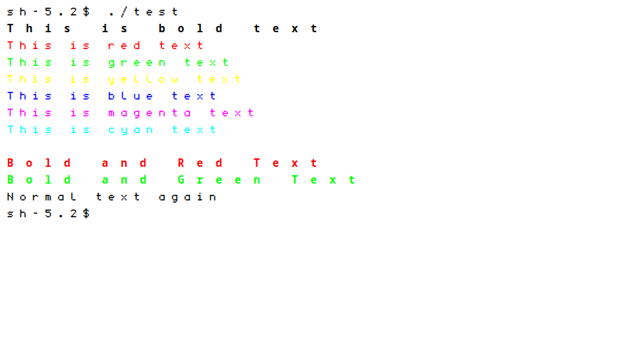

# cupidterminal

cupidterminal is a minimalist terminal emulator inspired by the principles of **suckless st**. It is designed to be **simple, efficient, and hackable**, adhering to the UNIX philosophy of doing one thing well.



## Features

- **Lightweight**: Minimal dependencies, only requiring `Xlib` and `Xft`.
- **Simple Configuration**: Easily customize fonts, colors, and terminal size by modifying `config.h`.
- **Efficient Rendering**: Utilizes `Xlib` for rendering text and handling input.
- **Keyboard Driven**: Optimized for keyboard navigation with minimal mouse support.
- **PTY Integration**: Spawns a shell using a pseudo-terminal (PTY) for seamless command execution.
- **Basic ANSI Escape Sequence Handling**: Strips out basic ANSI escape sequences for clean text rendering.
- **Line Buffering**: Maintains a buffer of up to 100 lines with 1024 characters each for terminal output.

## Dependencies

Ensure you have the following installed:

### For Arch Linux

```bash
sudo pacman -S xorg-server libx11 libxft
```

### For Debian/Ubuntu

```bash
sudo apt-get install libx11-dev libxft-dev
```

## Installation

Clone the repository and compile the source code:

```bash
git clone https://github.com/cupidthecat/cupidterminal.git
cd cupidterminal
make
```

## Usage

Run cupidterminal:

```bash
./cupidterminal
```

- **Quit**: Press `q` to exit the terminal emulator.

## Configuration

Customize cupidterminal by modifying the `config.h` file. Key configuration options include:

```c
#define FONT "monospace"       // Font family
#define FONT_SIZE 12            // Font size in points
#define TERMINAL_WIDTH 80       // Number of character columns
#define TERMINAL_HEIGHT 24      // Number of character rows
#define MAX_LINES 100           // Maximum number of lines in the buffer
#define MAX_CHARS 1024          // Maximum number of characters per line
```

### Steps to Configure:

1. Open `config.h` in your preferred text editor.
2. Adjust the configuration parameters as desired.
3. Recompile the project to apply changes:

    ```bash
    make clean && make
    ```

## Keybindings

- **Quit**: Press `ctrl+q` to close the terminal emulator. (Not yet implemented)
- **Backspace**: Handles backspace key to delete characters.
- **Input Handling**: All other keypresses are sent directly to the spawned shell.

## Roadmap / TODO

- [ ] Scrollback Buffer Support
  - **Goal**: Implement scrolling through past terminal output
  - **Status**: Planned feature for better terminal navigation

- [ ] Enhanced ANSI Escape Sequence Handling
  - **Goal**: Improve support for a wider range of ANSI codes for better text formatting
  - **Status**: Ongoing improvements to ANSI compatibility

- [ ] Dynamic Resizing
  - **Goal**: Allow the terminal window to be resized dynamically, adjusting the number of visible rows and columns accordingly
  - **Status**: Planned feature for better window management

- [ ] Clipboard Support
  - **Goal**: Enable copying and pasting text between the terminal and other applications
  - **Status**: Partially implemented with OSC 52 clipboard support in progress

- [ ] Mouse Support
  - **Goal**: Add basic mouse interaction capabilities
  - **Status**: Planned feature for better user interaction

- [ ] Theming
  - **Goal**: Introduce customizable color schemes and themes
  - **Status**: Planned feature for visual customization

- [ ] OSC 52 clipboard (remote copy)
  - **Goal**: Support remote clipboard copy via OSC 52 so ssh/tmux/vim can copy to your desktop
  - **Protocol**: Parse `ESC ] 52 ; c ; <base64> BEL` (also allow ST terminator `ESC \`)
  - **Where**: In `src/main.c` `handle_pty_output`, you already special‑case OSC; add a branch when the OSC payload starts with `52;`
  - **Action**: Base64‑decode the payload to bytes and write them to the X `CLIPBOARD` selection using your clipboard helpers
  - **Refs**: `src/input.c` `copy_to_clipboard`/`paste_from_clipboard` for selection handling; add a small helper to set clipboard from a provided buffer (bypassing screen scrape)

- [ ] Window title (OSC 0/2)
  - **Goal**: Update the X11 window title from the shell/app
  - **Protocol**: Handle `ESC ] 0 ; title BEL` and `ESC ] 2 ; title BEL`
  - **Where**: Beside the OSC handling in `src/main.c` `handle_pty_output`
  - **Action**: Extract the `title` string and call `XStoreName(display, window, title)`

- [ ] Erase sequences (CSI J/K)
  - **Goal**: Implement erasing behavior
  - **Protocol**:
    - `CSI K` (EL) erase in line: modes 0/1/2 (to end/start/entire line)
    - `CSI J` (ED) erase in display: modes 0/1/2 (to end/start/entire screen)
  - **Where**: `src/terminal_state.c` in `handle_ansi_sequence`
  - **Action**: Clear `terminal_buffer` cells and reset attributes for the affected region(s); keep cursor rules per mode

- [ ] Alternate screen & cursor save/restore
  - **Goal**: Support full‑screen apps (vim/less) without polluting the main buffer
  - **Protocol**: DECSET/DECRST 1049 (and optionally 47/1047) to switch between main and alternate screens
  - **Where**: `src/terminal_state.c` (state and switching), `src/terminal_state.h` (new fields), possibly a tiny hook in OSC/CSI path
  - **Action**: Maintain a second buffer and cursor; on set, save current buffer/cursor and swap to alternate; on reset, restore. Integrate with existing `s`/`u` (save/restore cursor)

- [ ] Truecolor and full 256‑color
  - **Goal**: Finish 24‑bit color paths in SGR
  - **Protocol**: `38;2;r;g;b` and `48;2;r;g;b` for exact RGB; `38;5;n`/`48;5;n` already mapped
  - **Where**: `src/terminal_state.c` `handle_ansi_sequence` under `p == 38 || p == 48`
  - **Action**: Allocate `XRenderColor` from `(r,g,b)` and assign to current fg/bg. Consider adding background tracking to cells when you implement background rendering

- [ ] Bracketed paste mode
  - **Goal**: Make pasted content detectable by TUI apps
  - **Protocol**: DECSET/DECRST `?2004` to enable/disable. When enabled, wrap pastes as `\e[200~` … pasted bytes … `\e[201~`
  - **Where**: Track a `bracketed_paste` flag in terminal state (`src/terminal_state.h/.c`). In `src/input.c` `paste_from_clipboard`, if enabled, emit the wrappers to the PTY
  - **Action**: Parse `CSI ? 2004 h/l` in `handle_ansi_sequence` to toggle the flag

### Implementation notes
- OSC parsing already exists in `handle_pty_output`; extend it rather than re‑parsing elsewhere
- Consider adding a tiny base64 decoder (or use a small public‑domain one) for OSC 52
- Clearing functions for J/K should zero glyph bytes and reset colors/fonts for the region

## License

cupidterminal is released under the **MIT License**. Feel free to modify and distribute it as per the license terms.

## Contributing

Contributions are welcome! If you have ideas for improvements or bug fixes, please submit a pull request or open an issue. When contributing:

- Keep changes minimal and focused.
- Follow the existing coding style for consistency.
- Provide clear descriptions and documentation for your contributions.

## Project Structure

- **main.c**: Handles initialization, event loop, PTY management, and integrates drawing and input handling.
- **draw.c / draw.h**: Manages rendering text to the X11 window and maintaining the terminal buffer.
- **input.h**: Declares input handling functions.
- **config.h**: Contains configuration settings for fonts, terminal size, and other parameters.
- **Makefile**: Build instructions for compiling the project.

## Acknowledgements

Inspired by the **suckless st** terminal emulator, aiming to maintain simplicity and efficiency while providing a solid foundation for further customization and enhancement.
